# Лабораторная 2 по дисциплине "Технологии программирования"

1. Сделайте копию репозитория с учебным проектом. Для этого перейдите под своей учетной записью GitHub по адресу https://github.com/kpdvstu/PTLab2 и нажмите кнопку Fork (рисунок 1).
2. Создайте папку для работы над проектом, перейдите в нее и сделайте клон учебного проектаиз Вашего репозитория: git clone https://github.com/........./PTLab2.git

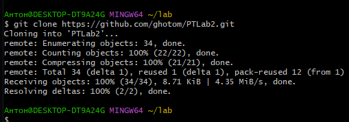

3. Установите сервер PostgreSQL, получив установочный файл с сайта: https://www.enterprisedb.com/downloads/postgres-postgresql-downloads В процессе установки задайте пароль учетной записи postgres, имеющей права администратора, в виде ps_password.
4. Найдите инструмент psql в списке установленных приложений и запустите его. Введите все необходимые параметры (все, кроме пароля, можно оставлять по умолчанию) и соединитесь с сервером PostgreSQL.

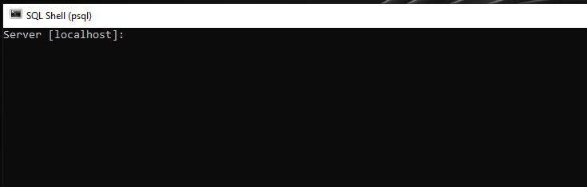
 
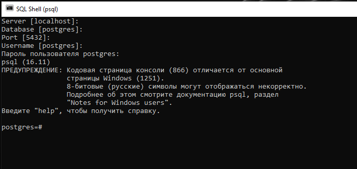

5. Создайте таблицу django_db: postgres=# create database django_db owner postgres; 

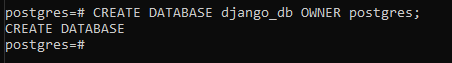

6. Проверьте, что база данных создалась: 2 postgres=# \l 
 
 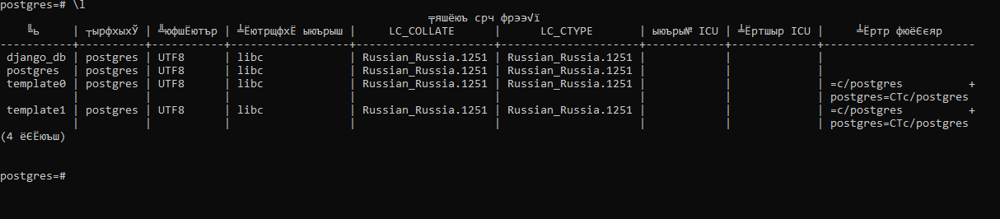

7. Если создание базы прошло успешно, выйдите из psql-клиента:
postgres=# \q В противном случае, устраните ошибку и добейтесь создания базы.
8. Установите переменную окружения со значением пароля администратора сервера PostgreSQL: $env:PYTHONPATH = "ps_password" 
9. Перейдите в директорию с проектом: cd <путь к директории>
10. Создайте виртуальное окружение Python: conda create -n tplab2-env python=3.8

 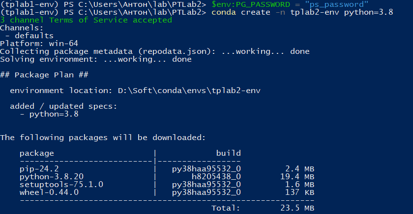

11. Убедитесь в успешной установке окружения. Активируйте созданное окружение командой: conda activate tplab2-env
 
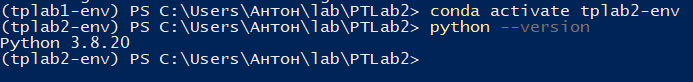

12. В созданном виртуальном окружении установите все требуемые для работы пакеты Python, перечисленные в файле requirements.txt: pip install –r requirements.txt

 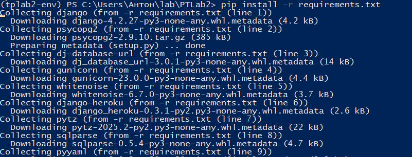

13. Создайте миграцию, которая определит необходимые таблицы в базе данных: python manage.py makemigrations
14. Выполните миграцию, добавив необходимые таблицы в базу данных: python manage.py migrate
 
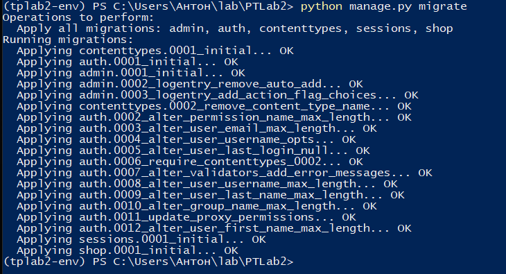

15. Для инициализации базы данных при запуске приложения загрузите в нее данные из фикстуры: python manage.py loaddata products.yaml

 

16. Выполните тестирование django-приложения: python manage.py test shop/tests/ Добейтесь выполнения всех тестов.
 
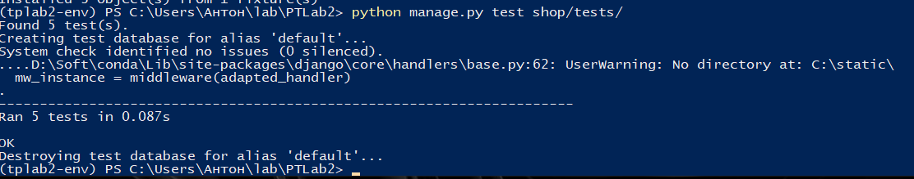

17. Запустите локально веб-сервер Django с приложением: python manage.py runserver Запустите браузер и перейдите в нем по адресу http://localhost:8000. Проверьте работоспособность приложения.
 
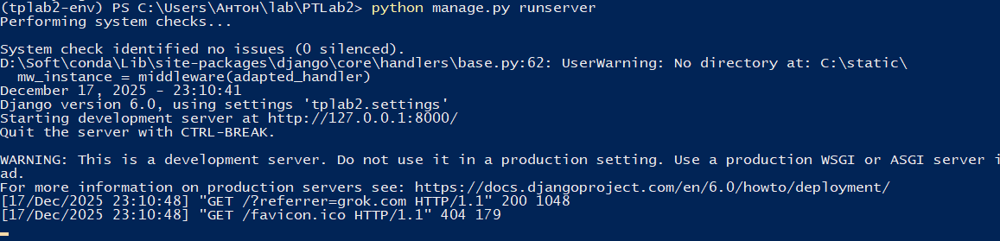

18. Остановите сервер, дважды нажав сочетание клавиш «Ctrl-C» в терминале.

 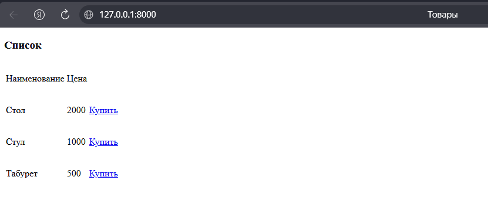

Индивидуальное задание
1. Выберите для Вашего проекта тип лицензии и добавьте файл с лицензией в проект.

 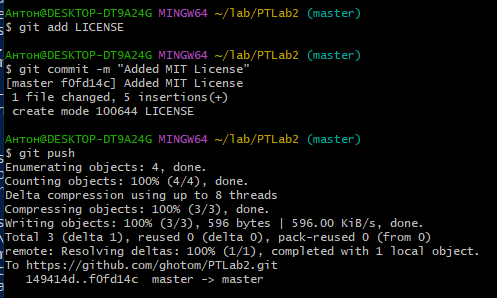

2. Доработайте проект магазина, добавив в него новую функциональность и информацию в базу данных в соответствии с типом магазина (согласно индивидуальному варианту, см. таблицу). Составьте модульные тесты к проекту, постарайтесь покрыть тестами максимально возможный объем кода. Для работы с этим заданием создайте новую ветку кода на основе главной и фиксируйте в нее весь программный код в процессе разработки. Добейтесь выполнения всех тестов проекта, после чего объедините текущую ветку кода с главной.

 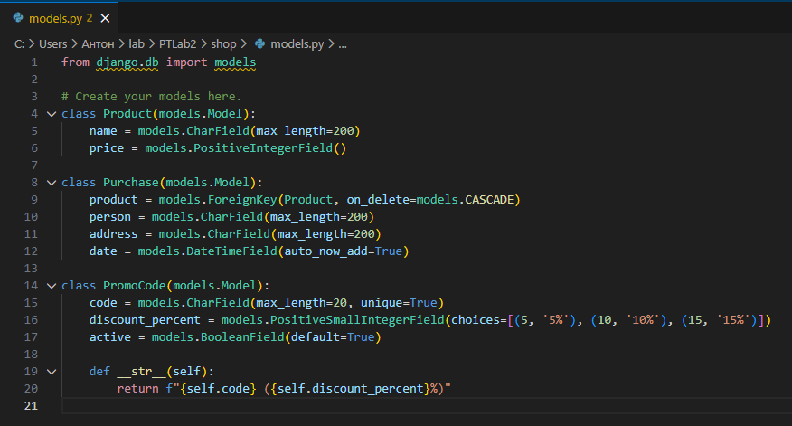

 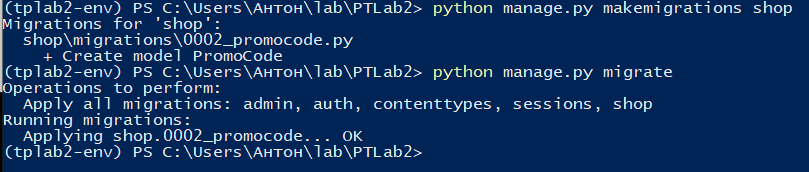

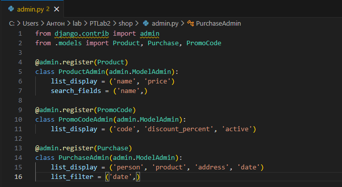
 
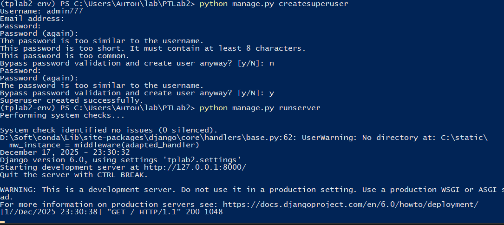
 
Добавление игрушек:

 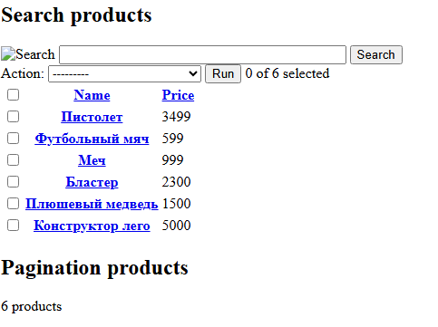

Добавление промокодов:
 

Создание формы для промокода:

 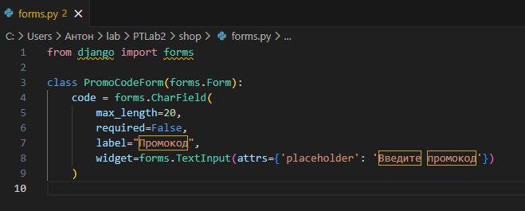

Доработаем views.py

 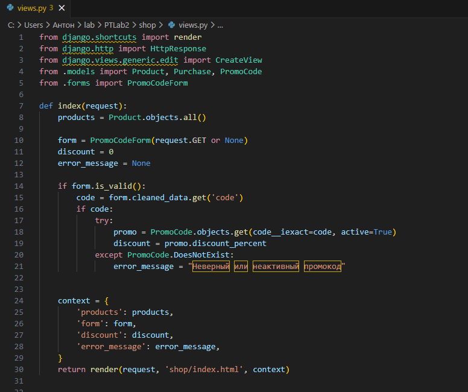

Меняем index.html

 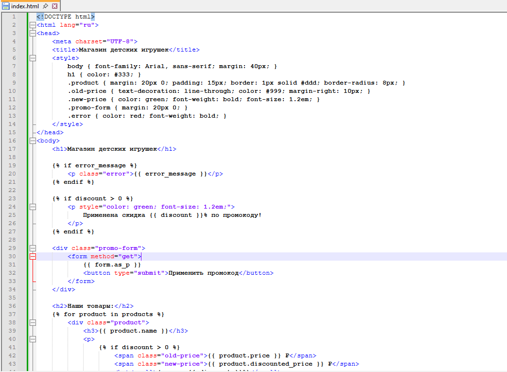

Заменим тесты под тематику:

 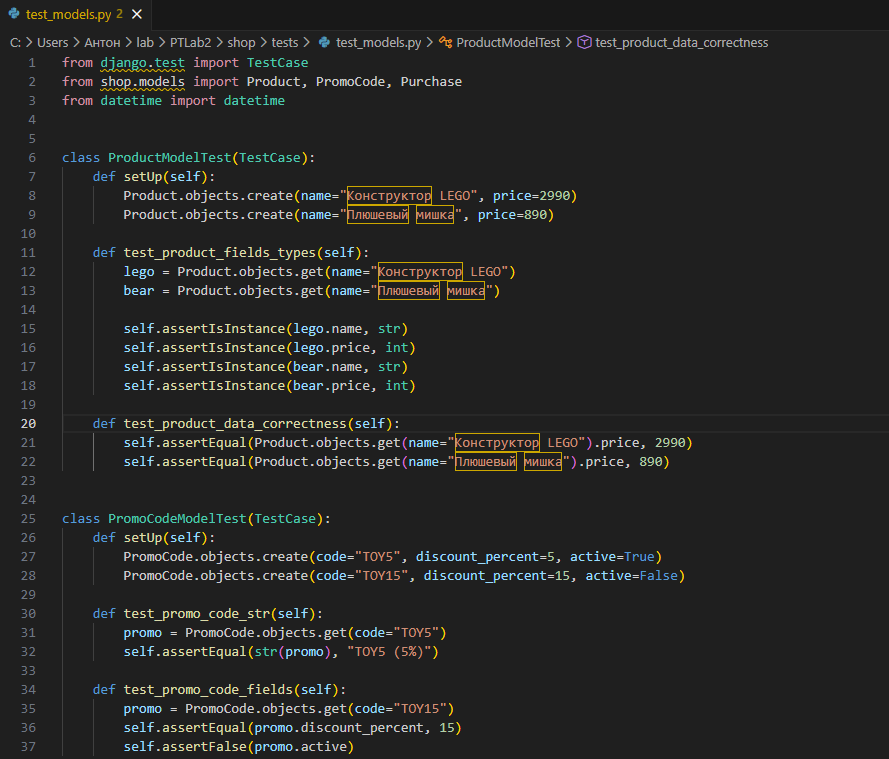

Добавим тест формы промокода:

 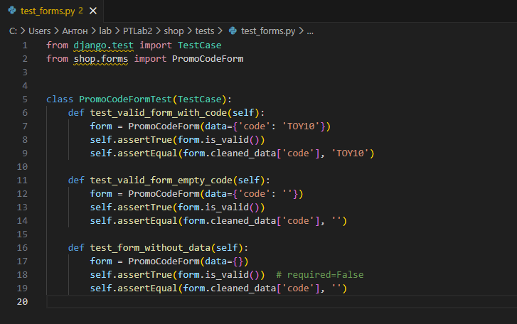

Тест представления:
 
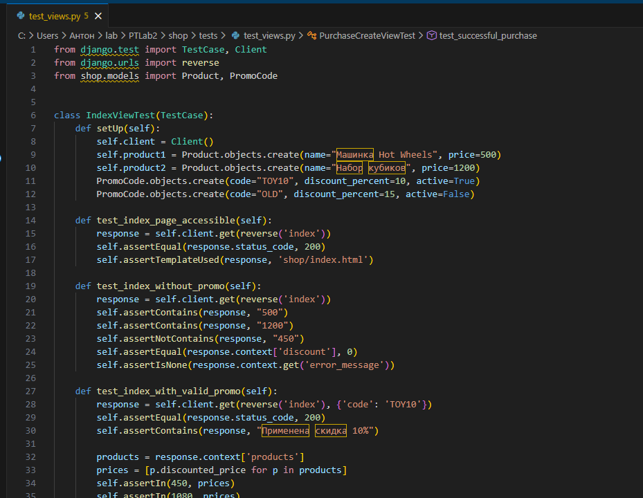

Результат тестов:
 
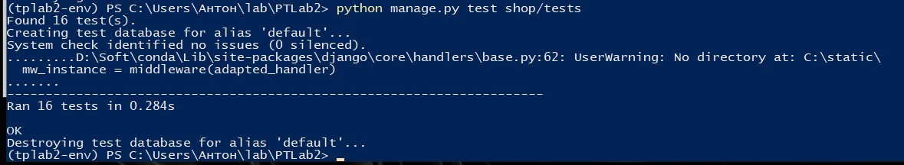

Проверка на соответствие стандартам:

 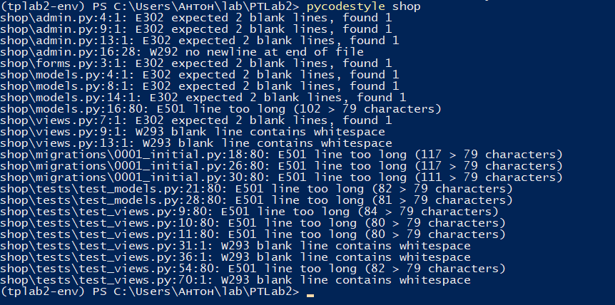

Исправляем:

 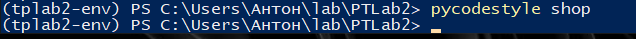

3. Обеспечьте автоматическое тестирование и разворачивание приложения на любом доступном хостинге. Для выполнения этих операций можно использовать любые инструменты CI / CD.
Настройка GitHub Actions (CI — автоматическое тестирование)

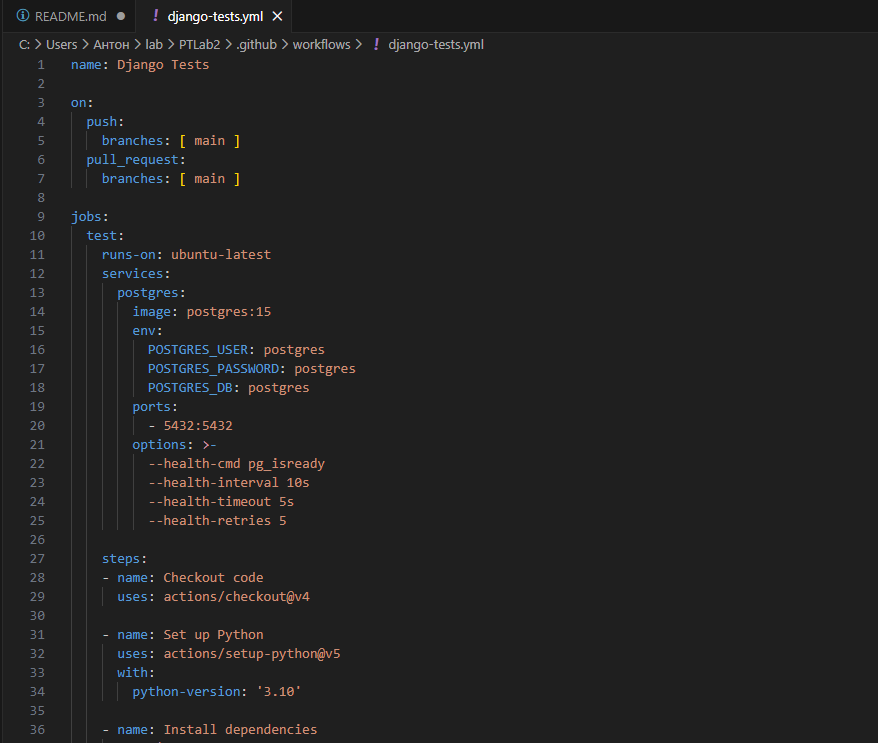

Результат:

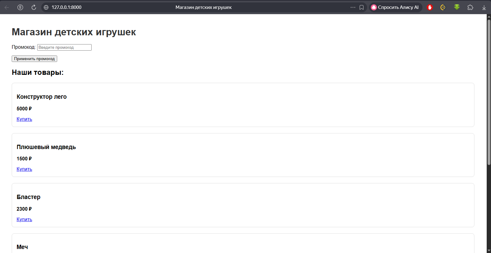

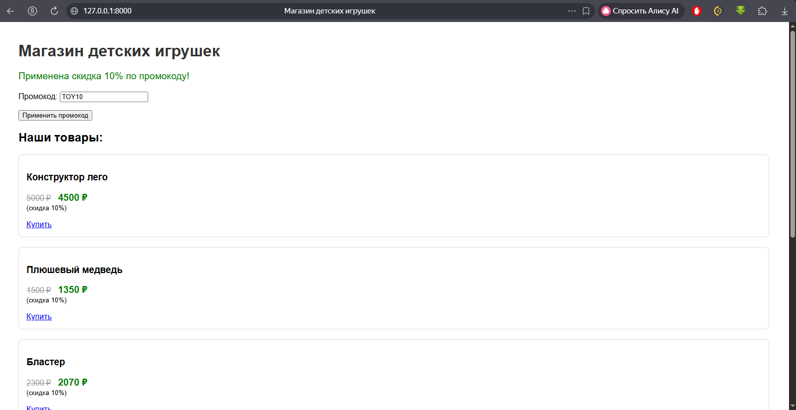

4. Проанализируйте полученные результаты и сделайте выводы.

В ходе выполнения лабораторной работы:

1. Изучена архитектура **MVC** на практике с использованием фреймворка Django:
   - **Model** — работа с данными через модели (`Product`, `PromoCode`, `Purchase`)
   - **View** — обработка логики (применение промокодов, расчёт цен со скидкой)
   - **Template** — динамическое отображение цен, форм и сообщений

2. Реализовано индивидуальное задание:
   - Магазин преобразован в магазин детских игрушек
   - Добавлена функциональность промокодов (5%, 10%, 15%)
   - Обработка неверных/неактивных промокодов

3. Написаны модульные тесты:
   - Модели, формы, представления
   - Проверка логики промокодов и оформления покупки